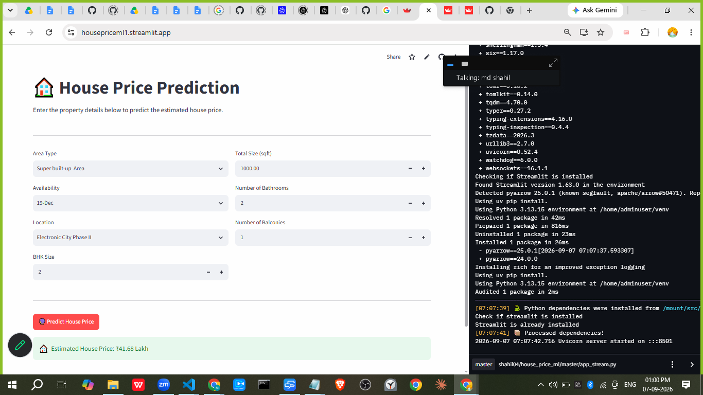

# House Price Prediction

A machine learning web application that predicts residential property prices in Bangalore based on property details.

## Live Demo

[Open the House Price Prediction app](https://housepriceml1.streamlit.app/)

## Dashboard



## Features

- Predicts estimated house prices in Indian lakh rupees.
- Supports location, area type, availability, BHK size, total area, bathrooms, and balconies as inputs.
- Uses a trained scikit-learn model saved in `model_Final.pkl`.
- Provides a Streamlit dashboard for the deployed application.
- Includes a Gradio interface in `app.py` as an alternative UI.

## Tech Stack

- Python
- Streamlit
- Gradio
- Pandas
- NumPy
- Scikit-learn

## Project Structure

```text
.
├── app_stream.py                         # Streamlit application
├── app.py                                # Gradio application
├── Cleaned_data.csv                      # Cleaned training dataset
├── house_price_prediction_ml_interface.ipynb  # Model development notebook
├── model_Final.pkl                       # Trained prediction model
├── locations.pkl                         # Location options
├── area_type.pkl                         # Area type options
├── avalibility.pkl                       # Availability options
├── requirements.txt                      # Python dependencies
└── img/dashboard.png                     # Dashboard screenshot
```

## Run Locally

1. Clone or download this repository.
2. Create and activate a virtual environment:

   ```bash
   python -m venv .venv
   ```

   Windows PowerShell:

   ```powershell
   .\.venv\Scripts\Activate.ps1
   ```

3. Install the dependencies:

   ```bash
   pip install -r requirements.txt
   ```

4. Start the Streamlit application:

   ```bash
   streamlit run app_stream.py
   ```

5. Open the local URL shown in the terminal.

## How It Works

The application loads the trained model and the saved input option lists, collects property details from the dashboard, and returns an estimated price in lakh rupees.

## Model Data

The model was developed using the cleaned Bangalore house price dataset in `Cleaned_data.csv`. The target column is `price`.